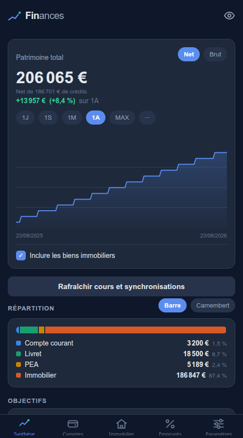
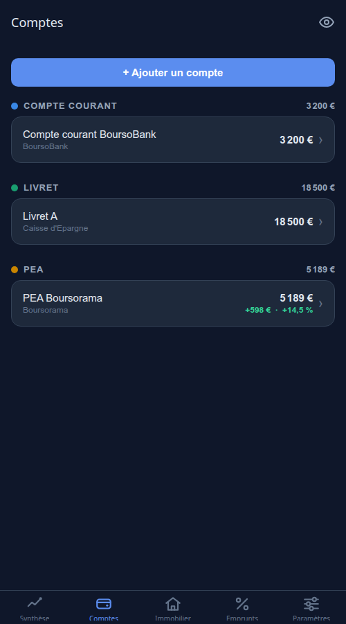
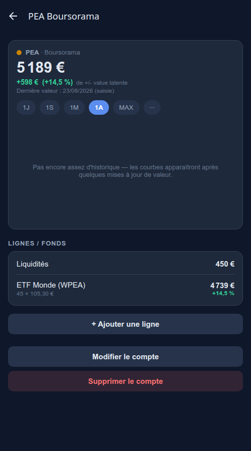
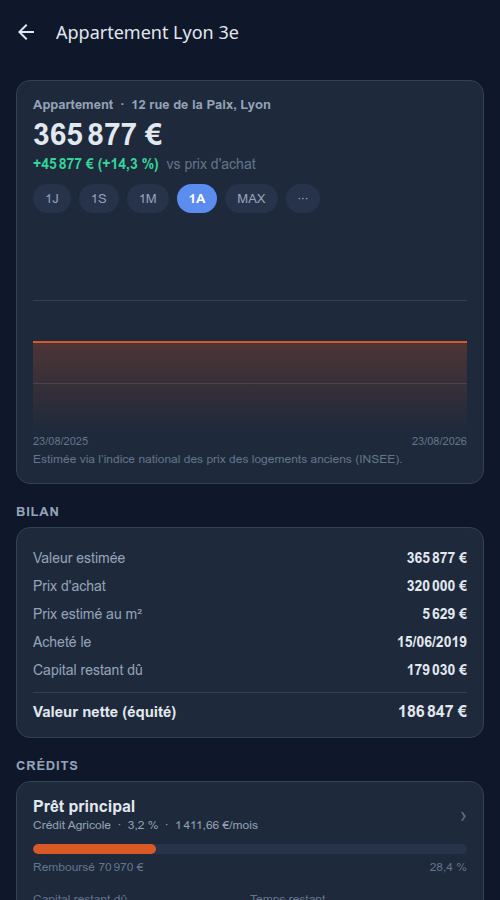
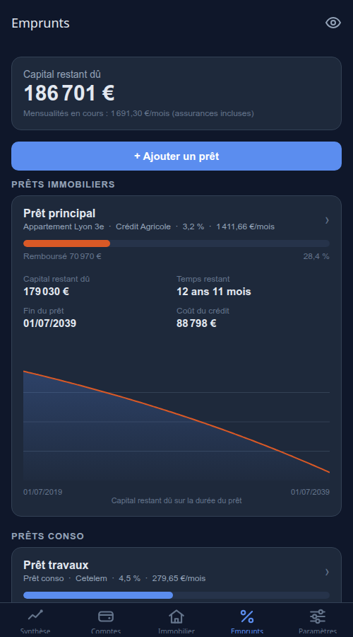

<p align="center">
  
</p>

<h1 align="center">Finances</h1>
<p align="center">
  Suivi de patrimoine personnel — comptes, bourse, crypto, immobilier et crédits.<br/>
  <b>React Native (Expo)</b>, un seul codebase pour Android, iOS, Web et Windows. Sans backend.
</p>

<p align="center">
  
  
  
  
</p>

Toutes les données et tous les identifiants restent sur l'appareil : pas de compte, pas de
serveur, pas de tracking. Les comptes se remplissent à la main ou se synchronisent depuis
quelques sources publiques (Binance, Kraken, banques françaises via Enable Banking, Trade
Republic) — voir [Pourquoi certaines choses sont comme elles sont](#pourquoi-certaines-choses-sont-comme-elles-sont)
pour le détail des contraintes.

## Aperçu

<table>
  <tr>
    <td align="center" width="33%">
      <br/>
      <sub>Synthèse</sub>
    </td>
    <td align="center" width="33%">
      <br/>
      <sub>Comptes</sub>
    </td>
    <td align="center" width="33%">
      <br/>
      <sub>Détail d'un compte</sub>
    </td>
  </tr>
  <tr>
    <td align="center" width="33%">
      <br/>
      <sub>Immobilier</sub>
    </td>
    <td align="center" width="33%">
      <br/>
      <sub>Emprunts</sub>
    </td>
    <td width="33%"></td>
  </tr>
</table>

## Sommaire

- [Fonctionnalités](#fonctionnalités)
- [Lancer l'app](#lancer-lapp)
- [Windows (application de bureau)](#windows-application-de-bureau)
- [Build Android automatisé (GitHub Actions)](#build-android-automatisé-github-actions)
- [Configurer les synchronisations](#configurer-les-synchronisations)
- [Architecture](#architecture)
- [Pourquoi certaines choses sont comme elles sont](#pourquoi-certaines-choses-sont-comme-elles-sont)
- [Avertissement](#avertissement)

## Fonctionnalités

**Vue d'ensemble**
- **Patrimoine net ou brut** : la synthèse totalise comptes + immobilier, avec un basculement
  **Net** (actifs − crédits) / **Brut**, et une case pour **inclure ou non les biens immobiliers**
  dans le total (les comptes bancaires de type immobilier, eux, sont toujours comptés).
- **Courbes de suivi** du patrimoine total et de chaque compte sur 1J / 1S / 1M / 3M / 6M / 1A /
  YTD / Max — les 5 échelles courantes en puces, les autres dans un menu déroulant (inspection au
  doigt, variation absolue et en %).
- **Mode Valeur ou Performance (%)** : basculement direct sur tous les graphiques historiques
  (Synthèse, comptes, biens immobiliers) et configurable dans **Paramètres → Affichage** entre
  la valeur absolue en devise et la performance relative en % sur la période choisie. En mode
  Performance, la courbe part de **0 % au premier jour de la période** et affiche l'écart relatif
  à ce point de référence : la **ligne repère 0 % en pointillés est toujours visible**, l'aire
  est ancrée dessus, et la courbe prend la **couleur du thème au-dessus de 0 %** et le **rouge
  en dessous**. L'infobulle rappelle le montant en devise correspondant au point survolé.
- **Répartition du patrimoine** par type de compte, en **barre empilée ou camembert**.
- **Projection patrimoniale future** : section interactive en dessous des objectifs permettant de simuler l'évolution prévisionnelle du patrimoine à 3, 5, 10, 15, 20 ou 30 ans :
  - **Visualisation Brute ou Nette** : prise en compte de l'**amortissement réel des crédits** mois par mois (les dettes diminuent selon leurs échéanciers jusqu'à extinction complète) ;
  - **Inclusion / exclusion de l'immobilier** au choix ;
  - **Rendement personnalisable ou historique** : choix d'un taux annuel libre (ex: 5 %) ou calcul automatique du taux de croissance géométrique annualisé (CAGR) sur votre historique réel (1M, 3M, 6M, 1A, MAX) ;
  - **Options avancées** : épargne mensuelle programmée, frais annuels de gestion avec calcul de leur impact cumulé, et ajustement à l'inflation pour visualiser en euros constants ;
  - **Décomposition à terme & Objectifs** : ventilation du capital projeté (apport initial, versements, gains générés, capital désendetté, frais) et estimation automatique de la date d'atteinte de vos objectifs d'épargne non encore atteints (calcul cohérent avec les poches financières, exclusion des biens physiques) ;
  - **Scénarios sauvegardés multiples** : enregistrement de vos simulations personnalisées avec nom et description, rechargeables en un clic et incluses dans l'export JSON.

**Comptes & placements**
- **Comptes classés par type** : compte courant, livret, PEA, CTO, assurance vie, PER, crypto,
  immobilier, autre.
- **Lignes / fonds par compte** : quantité, cours, valeur, plus/moins-value vs PRU, frais.
- **Plus/moins-value latente par compte** : agrégée sur les lignes à PRU connu, affichée dans la
  liste des comptes et sur le détail (en € et en %, convertie en EUR pour les comptes multi-devises).
- **Frais** : frais d'entrée, de gestion, droits de garde par compte ; frais courants par fonds.
- **Ajout manuel** de comptes et de lignes quand la synchro est impossible (cas notamment des
  PEA / CTO / assurances vie, non couverts par les API bancaires).
- **Cours automatiques** pour valoriser les lignes manuelles : actions / ETF / fonds cotés via
  Yahoo Finance (ticker, ex. `WPEA.PA`, conversion en € automatique) ; crypto via CoinGecko
  (id, ex. `bitcoin`).
- **Scraping JustETF automatique** : récupération en direct de la composition réelle des ETFs
  (ventilation multi-pays look-through, ventilation sectorielle, top 10 des positions pondérées,
  frais de gestion TER) et des actions individuelles (pays, secteur) par simple saisie de l'ISIN.

**Diversification & Conseils patrimoniaux**
- **Suggestions interactives enrichies** : cartes au format triptyque conforme à la réglementation AMF (non-CIF) comprenant :
  - **Constat factuel & chiffré** personnalisé sur vos données ;
  - **Pourquoi c'est important** (explication pédagogique du risque, volatilité, corrélation, fiscalité ou frais) ;
  - **Piste d'action recommandée** (méthodologie générale, rééquilibrage par les flux, prise de date).
- **Date d'ouverture fiscale des comptes** : saisie de la date d'ouverture (`Account.openingDate`) et calcul dynamique de l'ancienneté (affichée dans le détail du compte).
- **Suivi fiscal PEA & Assurance-Vie** :
  - **PEA** : règle des 5 ans (compte à rebours avant exonération d'impôt sur le revenu, retraits partiels autorisés sans clôture après 5 ans, suivi de l'approche du plafond des versements de 150 000 €).
  - **Assurance-Vie** : règle des 8 ans (compte à rebours avant déblocage de l'abattement annuel de 4 600 € / 9 200 € sur les plus-values, surveillance des frais d'enveloppe et de versement).
- **Détection des faux doublons d'ETF (*Look-through overlap*)** : analyse croisée des 10 premières positions sous-jacentes extraites de JustETF pour détecter la concentration réelle et invisible sur les méga-capitalisations (ex: Apple, Microsoft, Nvidia présents dans plusieurs ETF indiciels).
- **Audit des frais de gestion (*Fee drag*)** : calcul des frais annuels moyens pondérés (TER des fonds + frais de gestion des comptes) et alerte pédagogique sur l'impact de capitalisation négative des fonds onéreux (> 1,2 %).
- **Trésorerie dormante & Adéquation aux objectifs** : détection des liquidités excédentaires sur compte courant à transférer vers des livrets garantis (Livret A, LDDS), et contrôle de l'adéquation entre l'échéance des projets court/long terme et la volatilité des actifs.
- **Rééquilibrage par les flux entrants (*Cash-flow rebalancing*)** : recommandation de rééquilibrer par l'orientation des futurs versements réguliers (DCA) plutôt que par des arbitrages imposables.
- **Diversification sectorielle & géographique** : onglet dédié comparant votre patrimoine à un profil de référence (Prudent, Équilibré, Dynamique) et alertant sur les concentrations excessives.
- **Classification multi-sources** : JustETF (scraping temps réel pour ETFs UCITS et actions) → Yahoo Finance (secteur actions) → table locale de repli (`referenceEtfs.ts`).

**Immobilier & crédits**
- **Immobilier** : onglet dédié pour les biens physiques (appartement, maison, terrain…) —
  - **valeur estimée** réévaluée automatiquement via un indice national des prix des logements
    (INSEE, embarqué pour un fonctionnement hors-ligne), avec surcharge manuelle possible ;
  - **plus-value latente** (valeur − prix de revient), en € et en % ;
  - **quote-part détenue** (SCI / indivision) sur un bien ou un compte immobilier : le montant
    complet reste affiché, mais seule votre part est comptée dans le patrimoine.
- **Emprunts** : onglet dédié regroupant tous les prêts — crédits immobiliers (toujours
  rattachables à un bien) et **prêts conso** (sans rattachement), créables et modifiables
  depuis l'onglet ; les prêts conso sont déduits du patrimoine net. Échéancier d'amortissement
  calculé (mensualité, capital restant dû, coût total, temps restant), en mensualités
  **constantes** ou **échelonnées par paliers** (différé total/partiel géré), avec courbe du
  capital restant dû.

**Synchronisation automatique**
- **Binance** et **Kraken** : clé API *lecture seule*, valorisation EUR via les cours de l'exchange.
- **Banques via Enable Banking** (DSP2) : soldes des comptes de paiement — banques françaises,
  et **Revolut** via la Lituanie (sélecteur de pays).
- **Trade Republic** : API *non officielle* (login téléphone/PIN + 2FA), liquidités + positions
  valorisées en EUR. Android uniquement, à utiliser en connaissance de cause (voir plus bas).
- **Snapshots quotidiens** : chaque mise à jour (cours, synchro ou saisie) enregistre au plus un
  point par jour et par compte ; les courbes se construisent à partir de ces points (report de la
  dernière valeur connue pour les comptes non mis à jour).

**Confidentialité & personnalisation**
- **Thèmes** : choix entre le thème **Or** (sombre et or clair, par défaut) et le thème
  **Classique** (bleu-ardoise historique) dans **Paramètres → Affichage**.
- **Mode confidentialité** : icône œil dans l'en-tête de chaque onglet pour masquer
  instantanément tous les montants (les pourcentages de répartition et de performance restent
  visibles).
- **Personnalisation de l'affichage** : choix de la période par défaut des graphiques et de
  la variation, visibilité configurable des onglets (Immobilier, Emprunts, Diversification).
- **Multi-devises** : comptes et lignes en EUR (défaut), USD ou CHF — saisie dans la devise
  d'origine, affichage et courbes convertis en € avec les taux BCE
  ([frankfurter.dev](https://frankfurter.dev), rafraîchis à chaque mise à jour, derniers taux
  conservés hors ligne).
- **Export / import** JSON (sans les identifiants) : sauvegarde intégrale incluant comptes,
  lignes (avec ventilations sectorielles, géographiques, top holdings et frais issus de JustETF),
  historique des snapshots, biens immobiliers, crédits, objectifs d'épargne et scénarios de
  projection sauvegardés. Presse-papiers partout, et fichier (partage / sélecteur de documents) sur
  Android. Les exports antérieurs restent rétro-compatibles.

## Lancer l'app

```bash
npm install
npm run web        # version web (http://localhost:8081)
npm run android    # sur émulateur/appareil avec Android Studio, ou scannez le QR avec Expo Go
npm run ios        # sur simulateur/appareil iOS (macOS + Xcode requis)
```

Le plus simple sur téléphone : installer **Expo Go** (Play Store / App Store), lancer
`npx expo start`, scanner le QR code. Pour un binaire autonome :

```bash
npm install -g eas-cli                    # ou préfixer les commandes par `npx`
eas build -p android --profile preview    # APK — nécessite un compte Expo (gratuit)
eas build -p ios --profile preview        # .ipa — nécessite un compte Apple Developer (payant)
```

Le build iOS se fait sur le cloud EAS (pas besoin de macOS pour builder) ; EAS gère le
provisioning (certificat + profil) au premier build via votre login Apple. L'app déclare
`ios.bundleIdentifier` et `android.package` = `fr.perso.patrimoine`. Pour un build local,
`npx expo run:android` (Android Studio) ou `npx expo run:ios` (macOS + Xcode).

## Windows (application de bureau)

La version Windows empaquette l'export web dans une coquille **Electron**. Un petit serveur HTTP
local (port fixe `8099`) sert le build, et `webSecurity` est désactivé pour lever le CORS : les
connecteurs (Binance, Kraken, Enable Banking, Yahoo, Trade Republic) **fonctionnent** sur Windows,
contrairement à la version navigateur.

```bash
npm run windows:dev     # export web + lancement Electron (test rapide)
npm run windows:build   # génère un installeur .exe dans release/
```

`windows:build` produit un installeur NSIS dans `release/`. Notes :

- Les données (comptes, historique) sont dans le `localStorage` de l'origine `localhost:8099` —
  d'où le **port fixe**, pour les conserver d'un lancement à l'autre.
- Les secrets (clés API, identifiants) utilisent le repli `localStorage` d'`expo-secure-store`
  (pas de coffre-fort OS comme l'Android Keystore) : **moins protégés que sur Android**. À garder
  à l'esprit sur un poste partagé.

## Build Android automatisé (GitHub Actions)

Deux workflows produisent un **APK signé** et le publient dans les
[releases](../../releases) du dépôt. Ils font le même travail par deux chemins
différents — gardez celui qui vous arrange, ou les deux.

| | `APK Android (runner GitHub)` | `APK Android (EAS Build)` |
|---|---|---|
| Où ça compile | Runner Ubuntu GitHub | Serveurs Expo (EAS) |
| Compte Expo | non | oui (`EXPO_TOKEN`) |
| Quota / file d'attente | aucun | quota EAS, file d'attente sur le plan gratuit |
| Signature | votre keystore, via les secrets du dépôt | gérée par EAS |
| Déclenchement | tag `v*` **et** manuel | manuel uniquement |
| Durée typique | ~15 min | build + attente en file |

Les tags `v*` ne déclenchent que le workflow *runner* : si les deux se lançaient,
ils publieraient deux APK sur la même release.

### Lancer un build

- **Par un tag** : `git tag v1.1.0 && git push origin v1.1.0` → release `v1.1.0`
  (release normale, pas pre-release).
- **À la main** : onglet *Actions* → le workflow voulu → *Run workflow*. Sans tag
  fourni, la release s'appelle `v<version de app.json>-<n° de run>` et est marquée
  **pre-release**.

Dans les deux cas l'APK est aussi joint au run lui-même (*artifact*), récupérable
même si la publication de la release échoue.

### Secrets à configurer

*Settings → Secrets and variables → Actions.*

Pour le workflow **runner GitHub** (signature) :

| Secret | Obligatoire | Contenu |
|---|---|---|
| `ANDROID_KEYSTORE_BASE64` | oui | le keystore, encodé en base64 |
| `ANDROID_KEYSTORE_PASSWORD` | oui | mot de passe du **keystore** (le `-storepass`) |
| `ANDROID_KEY_ALIAS` | oui | nom de l'entrée à utiliser dans le keystore (le `-alias`) |
| `ANDROID_KEY_PASSWORD` | non | mot de passe de la **clé** ; à défaut, celui du keystore est réutilisé |

Un keystore est un conteneur pouvant abriter plusieurs clés, chacune repérée par
son **alias** — d'où `ANDROID_KEY_ALIAS`, obligatoire : Gradle doit savoir laquelle
signer. Chaque clé peut en théorie avoir son propre mot de passe, mais le format
**PKCS12** (celui de `keytool` par défaut depuis le JDK 9, donc celui de la commande
ci-dessous) ne le permet pas : `keytool` répond
*« Different store and key passwords not supported for PKCS12 KeyStores »* et ignore
la valeur. `ANDROID_KEY_PASSWORD` n'est donc utile que pour un ancien keystore **JKS**
dont la clé a un mot de passe distinct ; sinon, ne le déclarez pas.

Générez le keystore **une fois** et conservez-le précieusement : Android refuse
d'installer une mise à jour signée par une autre clé, donc le perdre signifie
désinstaller/réinstaller l'app (et perdre ses données) à la prochaine version.

```bash
keytool -genkeypair -v -keystore release.keystore \
  -alias finances -keyalg RSA -keysize 2048 -validity 10000
base64 -w0 release.keystore    # macOS : base64 -i release.keystore
```

Pour le workflow **EAS** : un seul secret `EXPO_TOKEN`
([expo.dev](https://expo.dev) → *Account settings* → *Access tokens*). Le profil
utilisé par défaut est `preview`, déclaré en `buildType: apk` dans `eas.json` —
`production` produit un **AAB** (dépôt Play Store), non installable directement,
et le workflow s'arrête avec un message explicite si on le lui demande.

### Signature : pourquoi un script de patch

Les dossiers natifs ne sont pas versionnés (CNG) : le workflow runner les régénère
avec `expo prebuild`, et le template Expo signe le buildType `release` avec la
**clé de debug**. `.github/scripts/apply-release-signing.mjs` injecte la vraie
signingConfig dans le Gradle généré, et le workflow vérifie ensuite avec
`apksigner` que l'APK publié n'est pas signé en debug — au moindre doute, le job
échoue plutôt que de publier.

## Configurer les synchronisations

### Binance / Kraken

1. Créez une clé API **lecture seule** (Binance : Gestion API, décochez trading/retraits ;
   Kraken : Settings → API, permission « Query Funds » uniquement).
2. Onglet **Connexions** → Binance ou Kraken → collez clé + secret.
3. Les clés sont stockées chiffrées dans l'Android Keystore (via `expo-secure-store`).

### Banques françaises (Enable Banking)

1. Créez un compte sur [enablebanking.com](https://enablebanking.com) et une **application**
   (environnement Production). En mode « restricted production » (gratuit, sans contrat),
   seuls les comptes que **vous** liez sont accessibles.
2. Enable Banking **n'accepte que des URL de redirection https** (pas de schéma
   `patrimoine://`). Deux options :
   - **Recommandé (GitHub Pages)** : la page [`docs/eb-callback.html`](docs/eb-callback.html)
     est prête à être déployée. Sur GitHub : *Settings → Pages → Deploy from a branch →*
     votre branche *→ dossier `/docs`*. L'URL à enregistrer chez Enable Banking sera
     `https://<votre-pseudo>.github.io/<nom-du-repo>/eb-callback.html`. Après validation chez
     la banque, cette page renvoie automatiquement vers l'app (`patrimoine://eb-callback`).
   - Tout autre hébergement statique (Cloudflare Pages, Netlify…) fonctionne aussi : servez le
     même fichier et enregistrez son URL https.
   - À défaut : enregistrez n'importe quelle URL https que vous contrôlez ; après validation,
     copiez l'URL complète de la page atteinte (elle contient `?code=…`) et collez-la dans
     l'app (champ « URL de redirection reçue »).
3. Onglet **Connexions** → « Banques françaises via Enable Banking » → collez l'Application ID,
   la clé privée PEM et la même URL https.
4. Choisissez votre banque, validez le consentement DSP2 chez elle (valable ~90 jours),
   les soldes sont importés.

## Architecture

```
src/
  app/                 écrans (expo-router) : onglets Synthèse / Comptes / Immobilier /
                       Emprunts / Diversification / Paramètres (connexions, sauvegarde,
                       affichage, entretien de l'historique, reclassification globale des lignes),
                       détail de compte et de bien, formulaires (compte, ligne, bien, prêt),
                       flux Enable Banking.
                       `holding-detail` : modal de détail d'une ligne classifiée — répartition
                       sectorielle, géographique, top positions, TER, source de classification
                       (JustETF / Yahoo / CoinGecko / référence locale). Accessible via le bouton
                       « Voir » sur les lignes qui ont des données de classification.
  components/          LineChart (SVG), AllocationBar, PieChart, ProgressBar, ThemedDialog, primitives UI
  lib/
    types.ts           modèle : Account, Holding, Snapshot, Connection, Property, Loan
    store.ts           store zustand persisté (AsyncStorage)
    secure.ts          secrets (expo-secure-store, repli localStorage sur web)
    portfolio.ts       valorisation comptes + construction des séries temporelles
    realestate.ts      estimation des biens, amortissement des crédits (constant/paliers)
    prices/            Yahoo Finance, CoinGecko, JustETF scraper (ETFs & actions) & indice INSEE
    connectors/        Binance, Kraken, Enable Banking (JWT RS256)
```

Données locales : documents (comptes, lignes, snapshots, connexions, biens et crédits immobiliers)
en JSON dans AsyncStorage ; secrets à part dans le stockage sécurisé. La valeur d'un bien et le
capital restant dû d'un crédit étant calculables analytiquement à toute date, la courbe immobilière
est dérivée sans stocker de snapshots. Aucun serveur tiers autre que les API officielles citées.

## Pourquoi certaines choses sont comme elles sont

<details>
<summary>DSP2, agrégateurs, Trade Republic, CORS — les contraintes qui façonnent l'app</summary>
<br/>

- **DSP2 ne couvre que les comptes de paiement.** Les PEA, CTO, assurances vie et PER ne sont
  accessibles que via les connecteurs propriétaires d'agrégateurs B2B payants (Powens, Linxo…).
  Sans backend ni contrat B2B, la seule voie est la saisie manuelle + valorisation automatique
  par les cours publics. C'est le choix de cette app.
- **Enable Banking** est le seul agrégateur agréé avec un mode gratuit self-service
  (« restricted production ») limité à **vos propres comptes** — exactement le cas d'usage ici.
  Revolut, Fortuneo et BoursoBank n'exposent **pas** d'API directe pour les particuliers (DSP2
  réservé aux prestataires agréés) : on passe donc par Enable Banking (Revolut = entité
  lituanienne, Fortuneo et BoursoBank = France).
- **Trade Republic** n'a aucune API officielle : le connecteur reprend le protocole non officiel
  du web-login (téléphone/PIN → code 2FA) et du flux WebSocket. Conséquences : validation 2FA à
  **chaque** synchronisation (pas de synchro silencieuse), fonctionne uniquement en natif Android,
  et **peut casser** si Trade Republic change son protocole ou active son pare-feu applicatif.
- **Yuh** (néobanque suisse) est hors périmètre DSP2 et n'expose pas d'API personnelle : suivi
  manuel uniquement.
- **CORS** : dans un navigateur, les API Binance, Kraken, Yahoo, Enable Banking et Trade Republic
  refusent les appels cross-origin. Ces fonctions marchent dans les apps natives (**Android**,
  **iOS** — pas de CORS en natif ; Trade Republic reste toutefois Android uniquement). Sur le web,
  le suivi manuel et CoinGecko fonctionnent.

</details>

## Avertissement

Outil de suivi personnel : les valorisations proviennent d'API publiques non garanties et
peuvent être approximatives (notamment la conversion EUR). Ce n'est pas un outil de conseil
en investissement.
